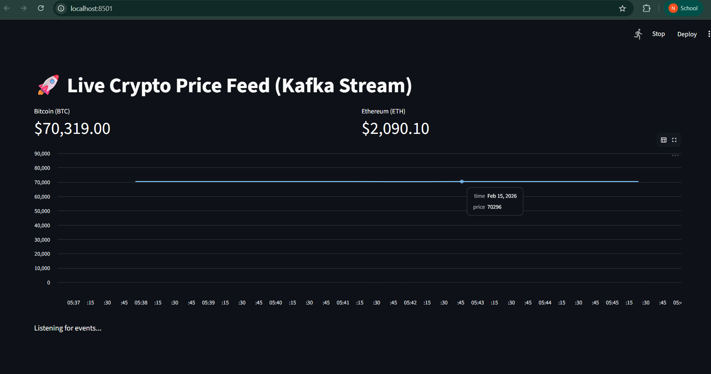
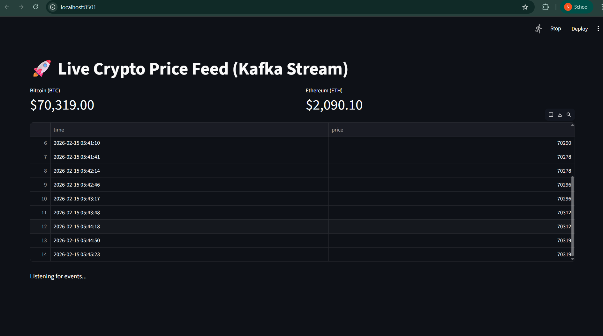

# 🚀 Real-Time Crypto Price Tracker

**"What is Bitcoin doing *right now*?"**

I built this project to move beyond static data analysis and tackle **Real-Time Streaming**. 
Instead of looking at yesterday's CSV files, this pipeline ingests, processes, and visualizes live cryptocurrency data (BTC & ETH) the moment it happens.

## 🛠️ How It Works (The Architecture)
This isn't just a Python script; it's a scalable **Producer-Consumer architecture**:

1.  **Ingestion (The Producer):** A Python script hits the CoinGecko API every 10 seconds to fetch live prices. It handles API rate limits and network errors gracefully.
2.  **Transport (Kafka):** Raw events are serialized to JSON and pushed to a Kafka topic (`crypto-stream`), decoupling the source from the destination.
3.  **Processing (Spark):** A Spark Structured Streaming job calculates sliding window averages (e.g., "Avg price over last 1 min") to smooth out volatility.
4.  **Visualization (Streamlit):** A live dashboard consumes the Kafka stream and updates an interactive line chart in real-time.

## 🧰 Tech Stack
* **Python 3.12+** (Logic & API interaction)
* **Apache Kafka** (Message Brokering)
* **Streamlit** (Real-time Dashboarding)
* **Docker** (Containerized Infrastructure)

## 🚀 How to Run It
1.  **Start Infrastructure:** `docker-compose up -d`
2.  **Start Producer:** `python crypto_producer.py`
3.  **Launch Dashboard:** `streamlit run dashboard.py`

---
*Created by [Your Name]*